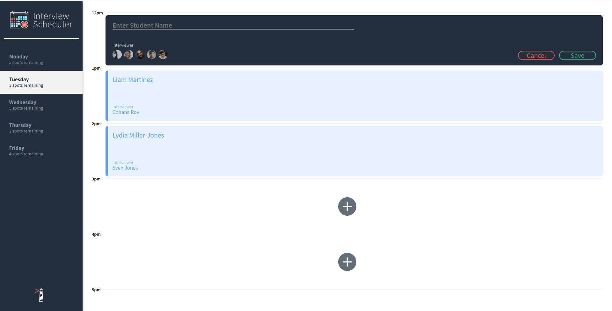

# Interview Scheduler

The LHL Interview Scheduler is a single page application built using React. This application allows users to book student names and select from an interview list to create interview appointments during a set week.

The application persists data using a separate API server using a PostgreSQL database to which it communicates via HTTP JSON formatted requests.

As stretch goals for this project, the application is hosted on Heroku (), features the use of  Websockets for live update rendering across browsers, and a complete suite of unit, integration, and end to end testing.

## Setup

Install dependencies with `npm install`.

## How to Use
1. Home page on desktop for Interview Scheduler!


2. Select a day by clicking on the sidebar and, once, selected, simply click a plus button to book an interview in an empty slot! 


3. Fill in the interviewee name and click on a headshot of one of our wonderful interviewers.


4. Simply click save and your new interview will be added.


5. Made a mistake? No problem, you can edit or delete appointments easily. 


6. Click confirm and your interview will become a distant memory. 


## Running Webpack Development Server

```sh
npm start
```

## Running Jest Test Framework

```sh
npm test
```

## Running Storybook Visual Testbed

```sh
npm run storybook
```
